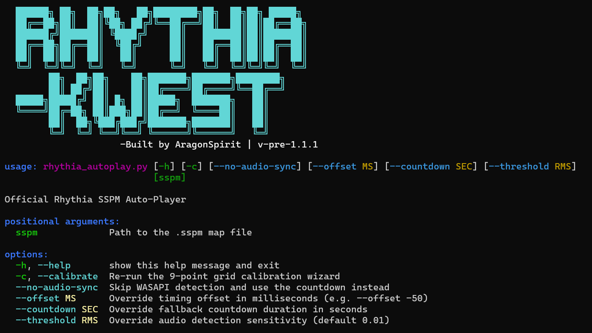
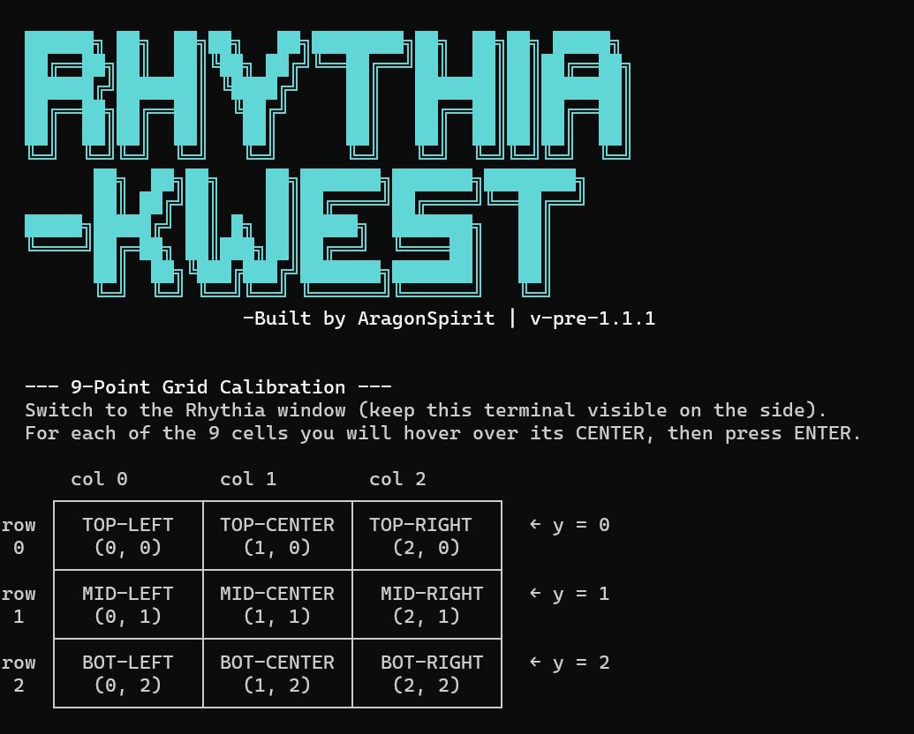
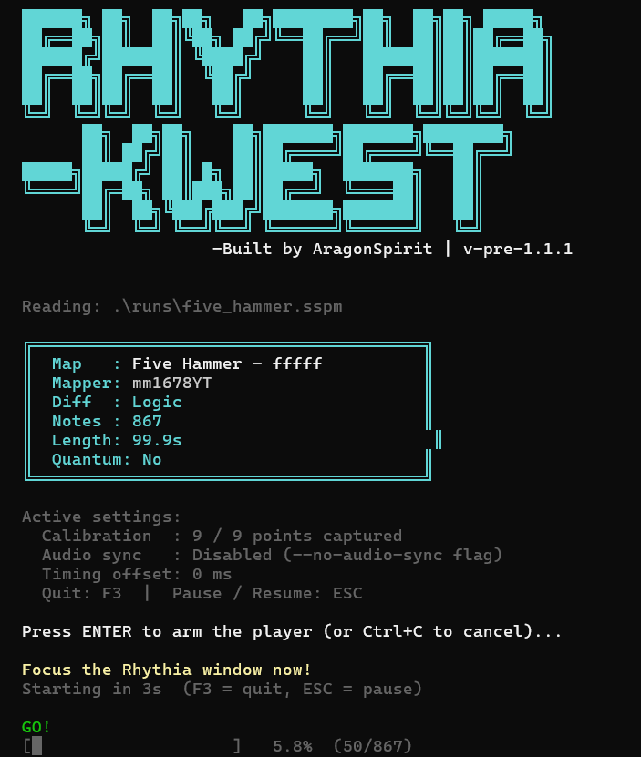

# Rhythia Kwest

> An autoplay bot for [Rhythia](https://rhythia.com/) that reads native `.sspm` map files and executes the notes in real-time.

---

## Screenshots

<!-- Startup banner & map info display -->
Startup banner:


<!-- Calibration wizard in action -->
Grid calibration wizard:


<!-- Live progress bar during playback -->
Live progress bar:


---

## Features

### Map Parsing
Loads any `.sspm` (Sound Space Plus Map) file using the `pysspm-rhythia` library, showing:
- Map name and mapper(s)
- Difficulty rating
- Total note count
- Map duration in seconds
- Whether the map uses quantum note positions

### Grid Calibration Wizard
On first launch or when passed the `--calibrate` flag, a wizard guides you through aligning the bot to your screen.

### Pause & Resume
You can press **ESC** to pause, then **ESC** again to resume.

### Audio Handling
The bot will automatically play the map's audio track when it starts.

### Emergency Stop
If your PC is about to blow up, press **F3** at any time to immediately exit the tool.

### Live Progress Bar
A progress bar is printed to the terminal showing percentage completion and the raw note counter

### Configuration
All settings are stored in `utils/rhythia_config.json`. Manual edits to this file are respected on the next launch. Running `--calibrate` overwrites only the grid coordinates.

---
## Changelog
- **v-1.0.0** - Initial release.
- **v-pre-1.1.1** - Added audio handling and remaking of calibration system
- **v-1.1.1** - *Coming soon...*
## Requirements

- **Python 3.10+**
- **Windows** (DirectInput is Windows-only)

---

## Installation

**1. Clone the repository**

```bash
git clone https://github.com/AragonSprt/Rhythia-Kwest
cd Rhythia-Kwest
```

**2. (Recommended) Create a virtual environment**

```bash
python -m venv .venv
.venv\Scripts\activate
```

**3. Install dependencies**

```bash
pip install -r utils/requirements.txt
```

> **Note on `pysspm` vs `pysspm-rhythia`:**
> This project uses `pysspm-rhythia` (v2), which ships its own `pysspm` module internally. Do **not** install the legacy `pysspm` package alongside it, they will conflict. If you have the old package installed, remove it first:
> ```bash
> pip uninstall pysspm
> pip install pysspm-rhythia
> ```

---

## Usage
> [!WARNING]
> >Inside Rhythia, change mouse settings from **"Relative"** to **"Absolute"** or else the tool will **NOT** work.

### First run (calibration required)

```bash
python rhythia_autoplay.py path/to/map.sspm
```

On the first launch, the calibration wizard starts automatically.

### Standard playback

```bash
python rhythia_autoplay.py "runs/my_map.sspm"
```

### Force re-calibration

```bash
python rhythia_autoplay.py "runs/my_map.sspm" --calibrate
```

### Apply a timing offset

```bash
# Delay all notes by 50 ms
python rhythia_autoplay.py "runs/my_map.sspm" --offset 50

# Fire all notes 30 ms earlier
python rhythia_autoplay.py "runs/my_map.sspm" --offset -30
```

### Override the countdown

```bash
python rhythia_autoplay.py "runs/my_map.sspm" --countdown 3
```

---

## Hotkeys

| Key     | Action               |
|---------|----------------------|
| `ESC`   | Pause / Resume       |
| `F3`    | Emergency stop       |
| `Ctrl+C`| Cancel before start  |

---

<br>

## Built by AragonSpirit
## ***v-pre-1.1.1***
